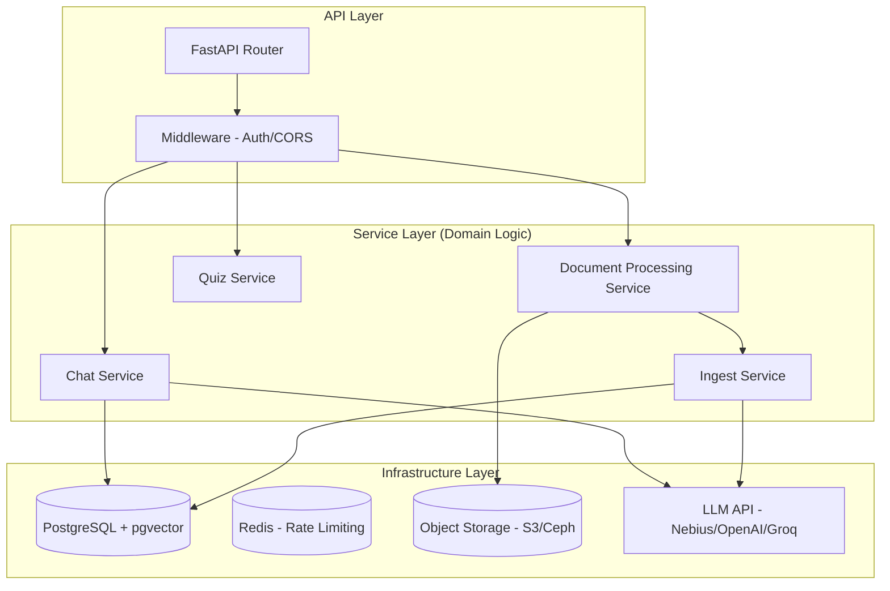
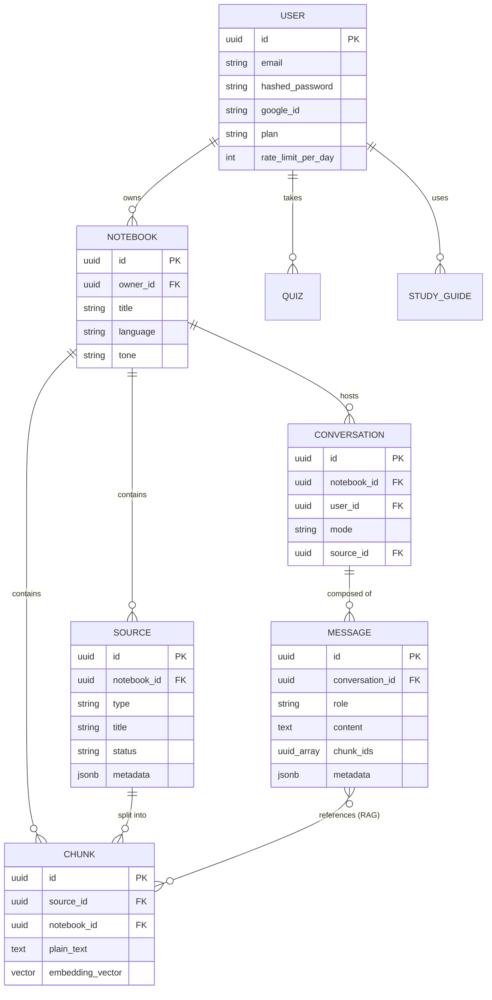
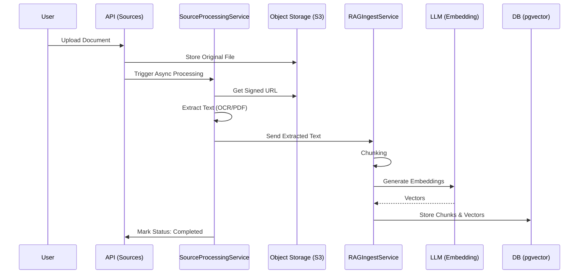
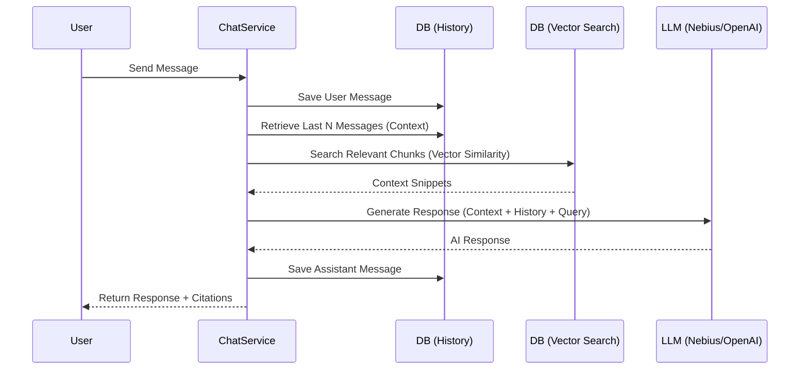

# MindSpring FastAPI Backend

An enterprise-grade, high-performance backend service built with FastAPI for the MindSpring AI learning platform. This service handles advanced AI features including context-aware RAG (Retrieval-Augmented Generation), document processing, autonomous quiz generation, and collaborative study tools.

## 🚀 System Architecture

MindSpring follows a clean, layered architecture inspired by Domain-Driven Design (DDD), ensuring high maintainability and scalability.



---

## 📊 Entity Relationship (ER) Diagram

The data model is optimized for hierarchical organization (Notebooks -> Sources -> Chunks) and conversational context (Conversations -> Messages).



---

## 🔄 Data Flows

### 1. Document Ingestion & RAG Indexing
This flow describes how a document is transformed from a raw file into searchable vector embeddings.



### 2. Context-Aware RAG Chat
This flow handles user queries by combining historical context with relevant document snippets.



---

## ⚡ Enterprise-Grade Performance

MindSpring is architected for high-scale, production environments, having undergone rigorous optimization and load testing.

### Performance Benchmarks
- **Concurrent Users**: Supports 1000+ simultaneous virtual users (VUs).
- **Latency**: Sub-200ms average response time; <300ms p95 SLA.
- **Success Rate**: >99.9% under peak load.
- **Storage Efficiency**: Native UUID implementation (7x reduction in ID storage vs standard string UUIDs).

### Optimization Strategies
- **Aggressive Indexing**: 45+ strategic indexes covering all critical query paths (Auth, RAG, Conversations).
- **N+1 Prevention**: Advanced eager loading (`selectinload`) used throughout the repository layer to eliminate redundant DB roundtrips.
- **Connection Pooling**: Optimized SQLAlchemy pooling (50+30 overflow) with health checks and stale connection recycling.
- **Job Recovery**: Indexed job queue polling for efficient background processing of documents and AI generations.

---

## ✨ Key Features

### 1. **Advanced Multi-Source RAG Engine**
- **Semantic Search**: Powered by `pgvector` for high-speed, accurate retrieval across multiple documents simultaneously.
- **Cross-Document Synthesis**: Answers queries by combining context from all sources in a notebook.
- **Auto-Chunking**: Intelligent document splitting with configurable overlap for better context retention.
- **OCR/PDF Processing**: Asynchronous extraction from PDFs and various text formats using a job-based architecture.

### 2. **Context-Aware Multi-Turn Conversations**
- **Deep Memory**: Conversations track history across multiple turns, allowing the AI to reference previous statements and cross-reference documents.
- **Smart Context Management**: Automatically prunes and manages LLM context windows for token efficiency.
- **Dual Mode Chat**:
    - **RAG Mode**: Precision answers grounded in your uploaded documents (single source or entire notebook) with citations.
    - **Chat Mode**: General conversational AI using only message history.

### 3. **Smart Learning Tools**
- **Autonomous Quizzes**: Generate context-specific quizzes from your study material.
- **Study Guides**: AI-driven synthesis of notebooks into structured study plans.
- **Notebook Organization**: Group sources and conversations by subject or project.

### 4. **Enterprise Infrastructure**
- **Layered Clean Architecture**: Decoupled domain logic following DDD principles.
- **GDPR Compliant**: Full soft-delete support on all 13 core entities for data retention compliance.
- **Scalable Auth**: Secure JWT-based authentication with Google OAuth2 integration.
- **Observability**: Structured logging and production-ready monitoring hooks.

---

## 🛠️ Tech Stack

- **Framework**: [FastAPI](https://fastapi.tiangolo.com/) (Python 3.11+)
- **Database**: [PostgreSQL](https://www.postgresql.org/) with [pgvector](https://github.com/pgvector/pgvector)
- **Object Storage**: [AWS S3](https://aws.amazon.com/s3/) (or compatible, e.g., Ceph)
- **LLM Integrations**: [Nebius](https://nebius.ai/), [OpenAI](https://openai.com/), [Groq](https://groq.com/)
- **Text Processing**: [PyMuPDF](https://pymupdf.readthedocs.io/en/latest/), [Httpx](https://www.python-httpx.org/)
- **Migrations**: [Alembic](https://alembic.sqlalchemy.org/)

---

## 🚦 Getting Started

### Prerequisites
- Python 3.11+
- PostgreSQL (with pgvector extension)
- Redis

### Installation

1. **Clone & Setup Environment**:
   ```bash
   git clone <repo-url>
   cd mindspring-fastapi
   python -m venv venv
   source venv/bin/activate  # Windows: venv\Scripts\activate
   pip install -r requirements.txt
   ```

2. **Configuration**:
   Copy `.env.example` to `.env` and fill in necessary keys.
   ```bash
   cp .env.example .env
   ```

3. **Database Migrations**:
   ```bash
   alembic upgrade head
   ```

4. **Run Server**:
   ```bash
   uvicorn app.main:app --reload --port 8000
   ```

---

---

## 📚 Documentation & Resources

### Core Documentation
- **[API Documentation](http://localhost:8000/docs)** - Interactive Swagger UI
- **[Feature Deep-Dive](./FEATURES.md)** - Detailed look at MindSpring's core capabilities
- **[Architecture Analysis](./ARCHITECTURE_ANALYSIS.md)** - Comprehensive architecture and performance analysis
- **[Notebook & Source Flow](./NOTEBOOK_SOURCE_FLOW.md)** - Complete guide to notebooks and sources

### Project Roadmap
- **[Phase 1 Summary](./PHASE1_SUMMARY.md)** - Critical database architecture fixes and optimizations
- **[Quick Start Guide](./QUICK_START.md)** - Fast-track your development environment setup

---

## 📚 API Endpoints

---

## 🔒 Security

- **JWT Auth**: Secure token-based authentication.
- **Resource Isolation**: Users can only access their own notebooks, sources, and conversations. 
- **Secret Management**: Environment-based configuration for sensitive API keys.

---

*Built with ❤️ for the MindSpring AI Platform.*
